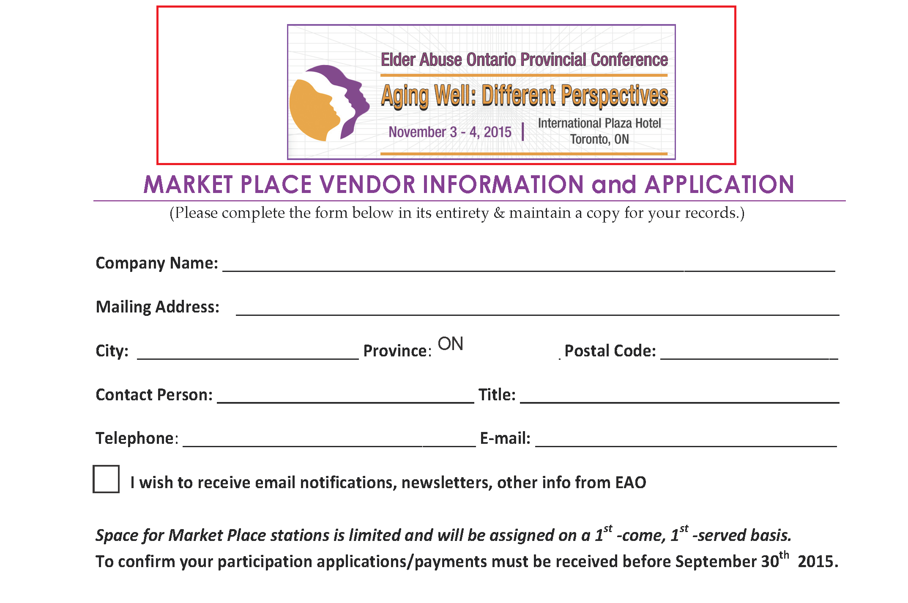
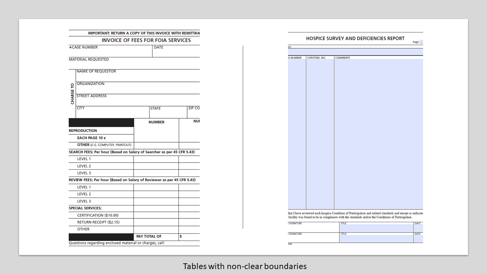
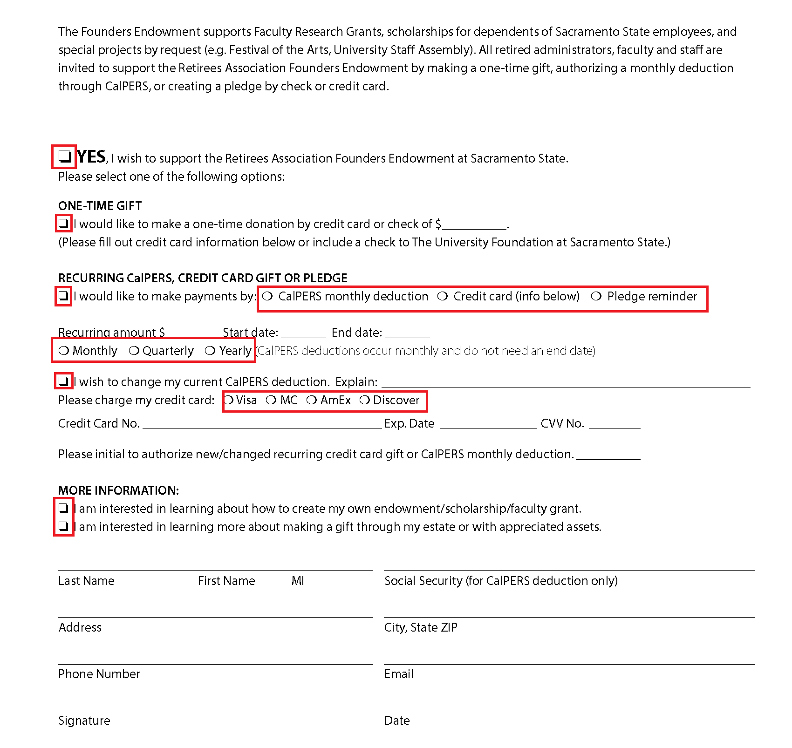
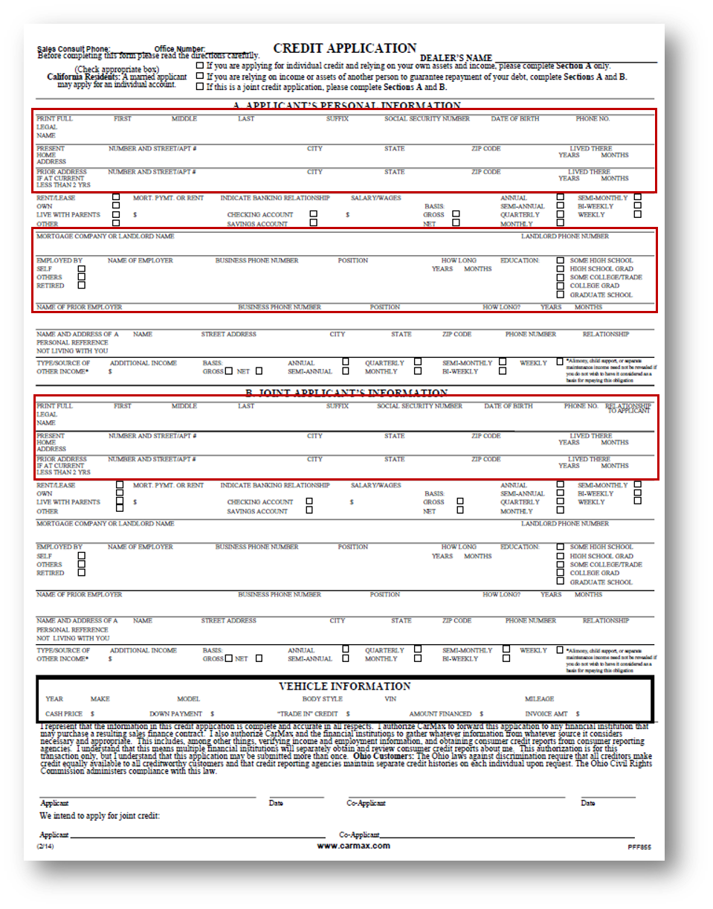
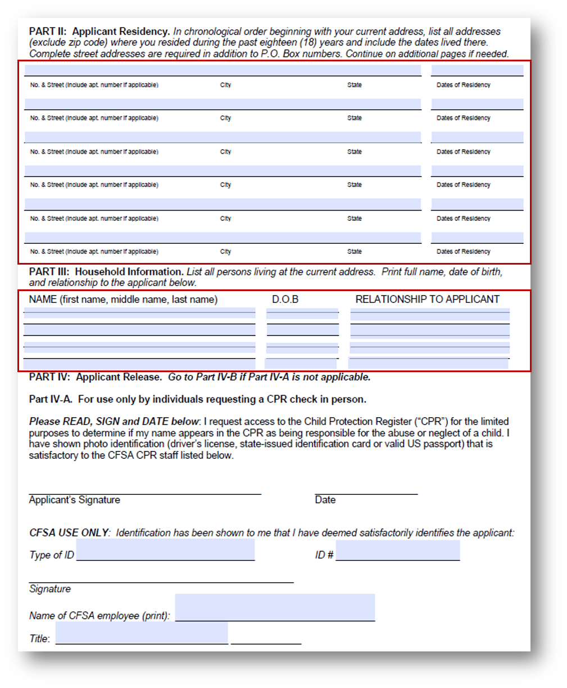
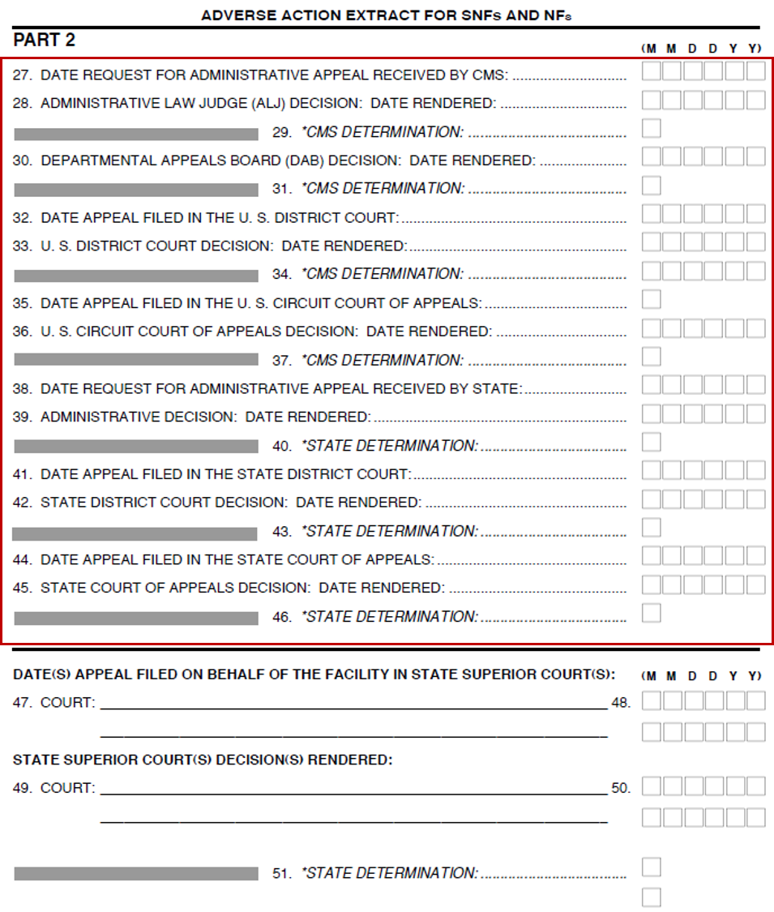
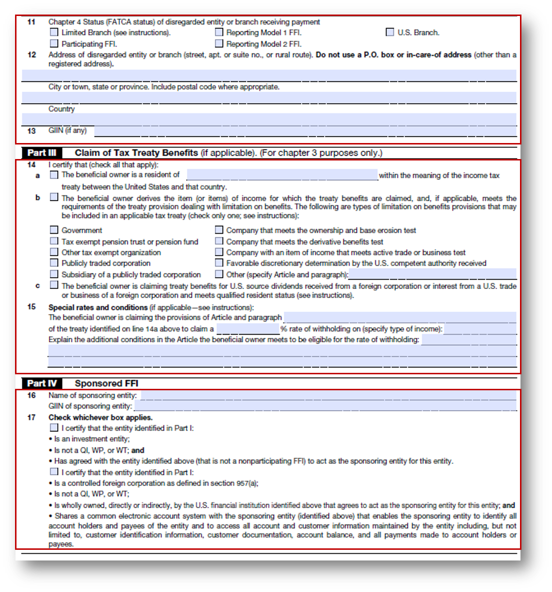
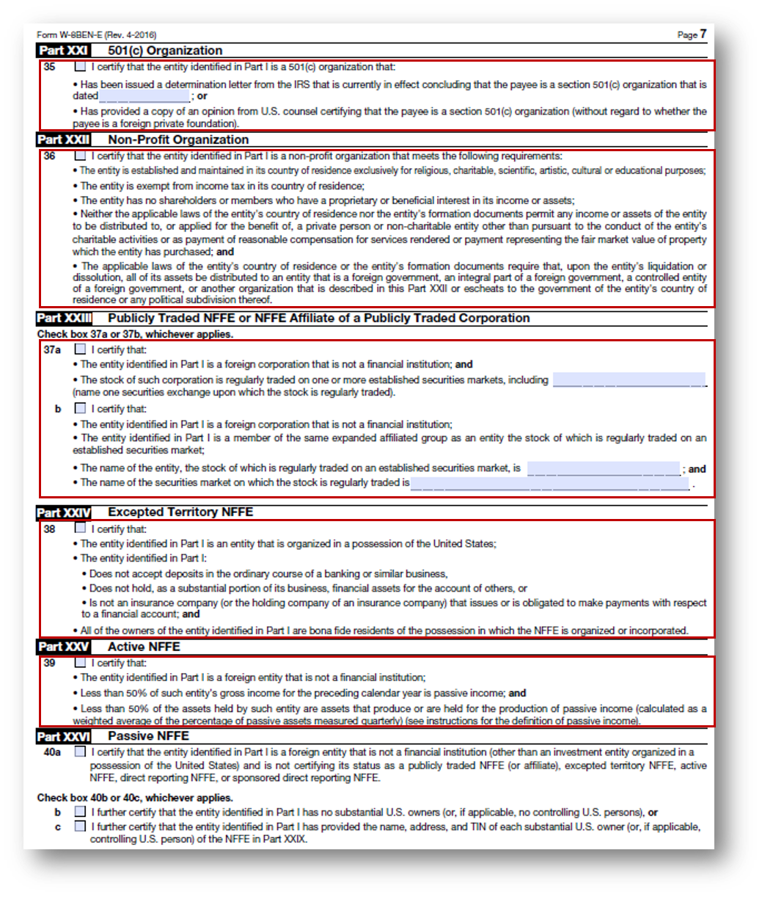
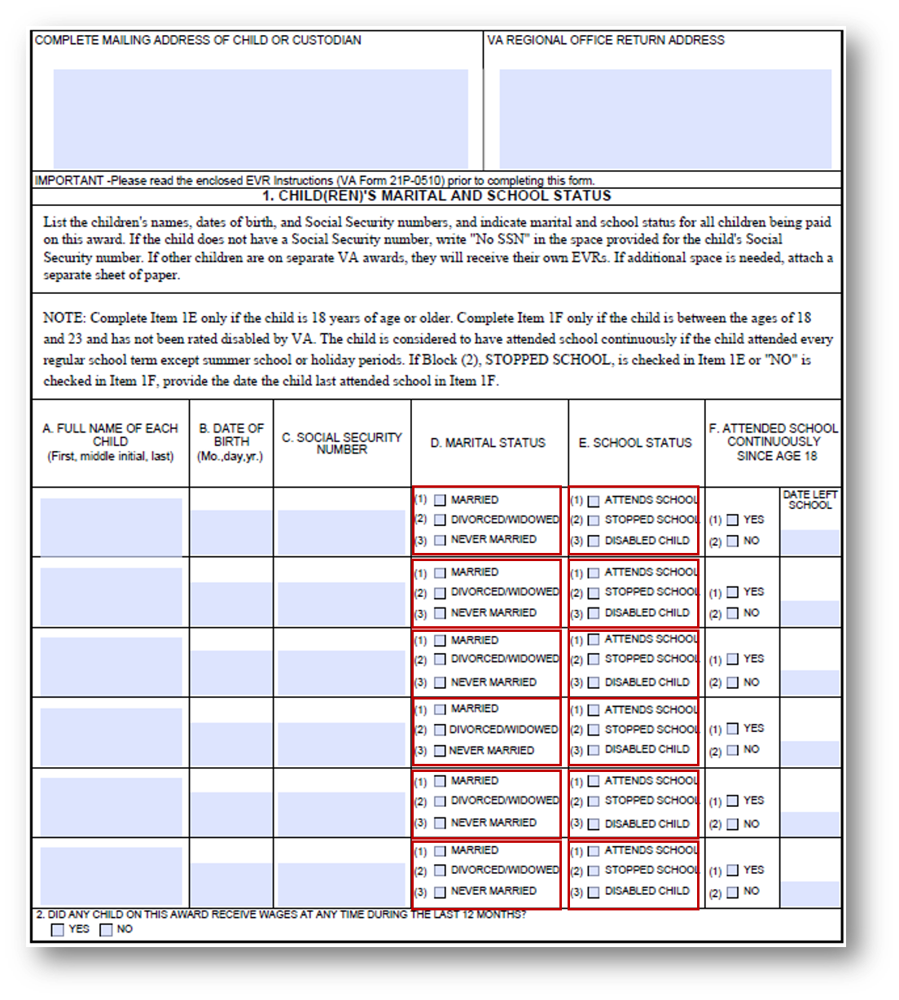

# 모범 사례 및 고려 사항 {#do-not-publish-best-practices-and-considerations}

<!--
[DO NOT PUBLISH]
-->

AEM Forms 자동 전환 서비스는 PDF 양식을 적응형 양식으로 전환합니다. 이 서비스는 인공지능과 머신러닝 알고리즘을 활용해 소스 양식의 레이아웃과 분야를 파악한다. 모든 머신 러닝 서비스는 소스 데이터에서 지속적으로 학습하고, 이탈할 때마다 향상된 출력을 생성합니다. 이러한 서비스들은 인간과 같은 경험으로부터 배운다.

Automated forms conversion 서비스는 다양한 양식 세트에서 교육됩니다. 소스 양식의 필드를 쉽게 식별하고 적응형 양식을 생성합니다. 하지만 PDF forms은 사람의 눈에는 쉽게 볼 수 있지만 서비스를 위해 이해하기 어려운 분야와 스타일이 존재한다. 이 서비스는 일부 필드 또는 스타일에 적용 가능한 필드 유형 또는 패널과 다른 필드 유형 또는 패널을 할당할 수 있습니다. 이러한 모든 필드 및 스타일 패턴은 아래에 나열되어 있습니다.

이 서비스는 소스 데이터에서 계속 학습하기 때문에 이러한 패턴에 올바른 필드 또는 패널을 식별하고 할당하기 시작합니다. 당분간 다음을 사용할 수 있습니다. [검토 및 수정](review-correct-ui-edited.md) 이러한 문제를 해결하기 위한 편집기. 문제를 수정하거나 더 자세히 읽기 전에 다음 사항에 대해 숙지하십시오. [적응형 양식 구성 요소](https://helpx.adobe.com/experience-manager/6-5/forms/using/introduction-forms-authoring.html).

## 일반 {#general}

<table border="1" cellpadding="1" cellspacing="0" style="border-collapse: separate; border-spacing: 0px;" width="100%"> 
 <tbody>
  <tr>
   <td width="30%">알려진 패턴 및 해상도</td> 
   <td width="70%">예</td> 
  </tr>
   <td>
<strong>패턴</strong>
 
서비스는 채워진 PDF forms을 적응형 양식으로 전환하지 않습니다.
 
 
 
<strong>해결</strong>
 
빈 적응형 양식을 사용하십시오.
 </td> 
   <td style="text-align: left;"></td> 
  </tr>
  <tr>
   <td>
<strong>패턴</strong>
 
서비스가 밀집된 형태의 텍스트와 필드를 인식하지 못할 수 있습니다.
 
 
 
<strong>해결</strong>
 
전환을 시작하기 전에 조밀한 형태의 텍스트와 필드 사이의 너비를 늘리십시오.
 </td> 
   <td style="text-align: left;"></td> 
  </tr>
  <tr>
   <td>
<strong>패턴</strong>
 
서비스가 스캔한 양식을 지원하지 않습니다.
 
 
 
<strong>해결</strong>
 
스캔한 양식을 사용하지 마십시오. 
 </td> 
   <td></td> 
  </tr>
  <tr>
   <td>
<strong>패턴</strong>
 
서비스는 이미지 내의 이미지와 텍스트를 추출하지 않습니다. 
 
 
 
<strong>해결</strong>
 
변환된 양식에 이미지 또는 텍스트를 수동으로 추가합니다.
 </td> 
   <td></td> 
  </tr>
  <tr>
   <td>
<strong>패턴</strong>
 
경계 및 테두리가 점선 또는 명확하지 않은 테이블은 변환되지 않습니다.
 
<strong>해결</strong>
 
명확한 경계와 테두리가 있는 표를 사용합니다. 지원됨.
 </td> 
   <td></td> 
  </tr>
 </tbody>
</table>

## 선택 그룹  {#choice-group}

<table border="1" cellpadding="1" cellspacing="0" width="100%"> 
 <tbody>
  <tr>
   <td width="30%">패턴</td> 
   <td width="70%">예</td> 
  </tr>
  <tr>
   <td>
<strong>패턴</strong>
 
상자 또는 원 이외의 도형이 있는 선택 그룹 옵션은 해당 적응형 양식 구성 요소로 변환되지 않습니다. 
 
 
 
<strong>해결</strong>
 
선택 옵션 모양을 상자 또는 원으로 변경하거나 검토 및 수정 편집기를 사용하여 모양을 식별합니다.
 </td> 
   <td> </td> 
  </tr>
 </tbody>
</table>

## 양식 필드 {#form-fields}

<table border="1" cellpadding="1" cellspacing="0" width="100%"> 
 <tbody>
  <tr>
   <td width="30%">패턴</td> 
   <td width="70%">예</td> 
  </tr>
  <tr>
   <td width="25%">
<strong>패턴</strong>
 
서비스는 명확한 테두리가 없는 필드를 식별하지 않습니다.
 
 
 
<strong>해결</strong>
 
검토 및 수정 편집기를 사용하여 이러한 필드를 식별합니다.
 
 
 
 
 </td> 
   <td width="50%">  </td> 
  </tr>
  <tr>
   <td>
<strong>패턴</strong>
 
서비스는 일부 양식 필드를 맨 아래 또는 오른쪽에 캡션이 있는 채로 둡니다.
 
 
 
<strong>해결</strong>
 
검토 및 수정 편집기를 사용하여 이러한 필드를 식별합니다
 </td> 
   <td>    </td> 
  </tr>
  <tr>
   <td>
<strong>패턴</strong>
 
서비스는 서로 매우 가까운 위치에 있거나 명확한 테두리가 없는 일부 양식 필드를 병합하거나 잘못된 유형을 지정합니다. 
 
 
 
<strong>해결</strong>
 
검토 및 수정 편집기를 사용하여 이러한 필드를 식별합니다.
 </td> 
   <td></td> 
  </tr>
  <tr>
   <td>
<strong>패턴</strong>
 
서비스가 멀리 있는 캡션 또는 캡션과 입력 필드 사이에 점선이 있는 필드를 인식하지 못할 수 있습니다.
 
 
 
<strong>해결</strong>
 
경계가 명확한 양식 필드를 사용하거나 검토 및 수정 편집기를 사용하여 이러한 문제를 수정하십시오.
 </td> 
   <td></td> 
  </tr>
 </tbody>
</table>

## 목록 {#lists}

<table border="1" cellpadding="1" cellspacing="0" width="100%"> 
 <tbody>
  <tr>
   <td width="30%">패턴</td> 
   <td width="70%">예</td> 
  </tr>
  <tr>
   <td>
<strong>패턴</strong>
 
양식 필드가 포함된 목록은 해당 적응형 양식 구성 요소로 병합되거나 변환되지 않습니다.
 
<strong>해결</strong>
 
경계가 명확한 양식 필드를 사용하거나 검토 및 수정 편집기를 사용하여 이러한 문제를 수정하십시오.
 </td> 
   <td></td> 
  </tr>
  <tr>
   <td>
<strong>패턴</strong>
 
서비스는 몇 개의 중첩된 목록을 미식별 상태로 둘 수 있습니다.
 
 
 
<strong>해결</strong>
 
검토 및 수정 편집기를 사용하여 이러한 문제를 해결합니다.
 </td> 
   <td> </td> 
  </tr>
  <tr>
   <td>
<strong>패턴</strong>
 
서비스는 선택 그룹이 포함된 일부 목록을 서로 병합합니다.
 
<strong>해결</strong>
 
검토 및 수정 편집기를 사용하여 이러한 문제를 해결합니다.
 </td> 
   <td> </td> 
  </tr>
 </tbody>
</table>

<!--
Comment Type: draft

<h3>Choice groups</h3>
-->

<!--
Comment Type: draft

<ul>
<li>Lists with form fields, nested lists, and nested choice groups are not supported.</li>
<li>Form fields with captions at bottom or right are not supported.</li>
<li>Form fiields without bordes are not supported.</li>
<li>Hidden form fields are not supported.</li>
<li>Button in PDF forms are not converted to adaptive form buttons.  </li>
<li>Tables with clear explicit boundaries and borders are supported.</li>
<li>Fields with far away captions are not supported.  </li>
<li>Choice groups with only box or circle shaped selectors are supported. </li>
</ul>
-->

