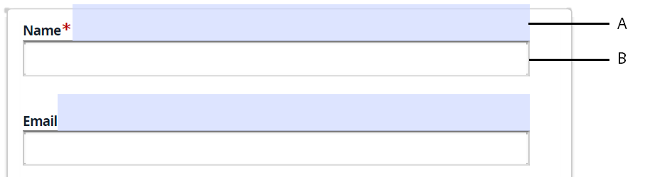

# 알려진 문제 및 제한 사항 {#known-issues-limitations}

AEM Forms Automated forms conversion 서비스를 사용하기 전에 다음의 알려진 문제 및 제한 사항을 검토하십시오.

## 알려진 문제 {#known-issues}

* 변환할 양식이 포함된 폴더의 양식 수는 총 15개와 50페이지를 초과할 수 없습니다. 소스 폴더의 크기는 10MB를 초과할 수 없습니다. 소스 폴더에 하위 폴더를 만들지 마십시오.
* 일부 형태 물체는 사람의 눈에 쉽게 보이지만, [서비스를 식별하기 어려움](styles-and-pattern-considerations-and-best-practices.md). 사용 [편집기 검토 및 수정](review-correct-ui-edited.md) 이러한 양식 개체를 식별하고 변환합니다.
* 검토 및 수정 편집기:

   * 실행 취소 작업이 없습니다. 저장 버튼을 누르면 변경 사항이 영구적으로 저장됩니다.
   * XFA 기반 양식에 대해 반복 가능한 패널을 지원하지 않습니다.
   * 검토 및 수정 편집기를 사용하여 테이블의 목록을 수정하는 경우 행 너비가 자동으로 조정되지 않고 텍스트가 테이블의 다음 행으로 넘칠 수 있습니다.
   * 다음 **[!UICONTROL Auto-detect multi-column layout from input forms]** 이 기능은 검토 및 수정 편집기 및 양식 조각에서 작동하지 않습니다.
   * 검토 및 수정 편집기로 만든 스크리블 서명이 게시된 적응형 양식에 대해 로드되지 않습니다.

* XFA 기반 양식의 경우:
   * XFA 기반 양식에서 조각 추출은 지원되지 않습니다.
   * XFA 스크립트는 지원되지 않습니다. 예를 들어 드롭다운 구성 요소에 대한 값을 자동으로 생성하는 스크립트입니다.
   * 선택 그룹에 대해 메타 모델이 작동하지 않음
   * 단일 문자가 있는 선택 그룹 옵션이 식별되지 않음
   * 소스 문서가 동적 XFA(.XDP)이고 [적응형 양식의 XFA 속성 동작을 정의합니다.](https://helpx.adobe.com/experience-manager/6-5/forms/using/xfa-api-supported-in-adaptive-form.html#supportedxfaelementsandtheirmappinginadaptiveformsbr)을 지정하면 소스 문서의 현재 상태 속성이 적용되지 않습니다. 예를 들어 소스 문서의 필드는 숨겨진 것으로 표시되고 스크립트는 필드를 표시하게 하지만 필드는 출력 적응형 양식에 계속 표시됩니다.

* 를 사용할 때 **생성된 적응형 양식에 대해 입력 AcroForm을 기록 문서(DoR)로 사용** 옵션을 사용하려면 다음 사항을 고려하십시오.

<table>
    <tr>
        <td>복합 텍스트 필드에 대한 바인딩 및 데이터가 유실됩니다. 복합 텍스트 필드에는 여러 텍스트 상자가 정렬되어 있습니다. 예를 들어 AcroForm에서 신용카드 번호는 여러 텍스트 상자로 분할되고 각 텍스트 상자에는 별도의 바인딩이 있습니다. AcroForm이 적응형 양식으로 변환되면 변환된 적응형 양식은 모든 텍스트 상자에 대해 단일 바인딩을 갖게 됩니다. 해결 방법으로, AcroForm을 적응형 양식으로 전환하기 전에 AcroForm을 수정하여 단일 텍스트 상자를 사용하여 신용 카드 번호를 수락합니다.</td>
        <td>                                                            </td>
    </tr>
    <tr>
        <td>복합 날짜 필드에 대한 바인딩 및 데이터가 유실됩니다. 복합 날짜 필드는 세 개의 서로 다른 필드로 구성됩니다. 예를 들어 AcroForm의 생년월일 필드는 세 개의 개별 필드로 분할됩니다. 적응형 양식은 기본 날짜 선택기 구성 요소를 제공합니다. AcroForm의 바인딩을 유지하면서 적응형 양식의 날짜 선택기 구성 요소를 사용하려면 AcroForm을 적응형 양식으로 전환하기 전에 단일 날짜 필드를 사용하도록 AcroForm을 수정하십시오.</td>
        <td></td>
    </tr>
    <tr>
        <td>확인란 크기가 함께 제공되는 텍스트보다 크면 확인란이 검색되지 않고 AcroForm의 바인딩이 손실됩니다. AcroForm을 수정하여 확인란 크기를 함께 제공되는 텍스트보다 작게 만듭니다.</td>
        <td> </td>
    </tr>
    <tr>
        <td>입력 필드들이 대응하는 텍스트-필드에 정렬되지 않으면, 입력 필드는 검출되지 않는다.  </td>
        <td></td>
    </tr>
    <tr >
        <td>이 서비스는 AcroForm의 모든 확인란을 별도의 선택 그룹으로 변환합니다. AcroForm을 사용한 바인딩을 보존하기 위해 별도의 선택 그룹이 만들어집니다. 적응형 양식에 선택 그룹을 병합하지 마십시오. 이로 인해 바인딩이 손실됩니다. 선택 그룹을 병합하는 경우 손실된 바인딩을 다시 가져오려면 양식을 다시 변환합니다. </td>
        <td></td>
    </tr>
    <tr >
        <td>일부 테이블의 경계는 자동으로 생성된 기록 문서(DoR)의 페이지에서 확장됩니다. </td>
        <td></td>
    </tr>
</table>

## 제한 사항 {#limitations}

* 복잡한 동적 레이아웃, 점선 윤곽선이 있는 필드 또는 채워진 필드가 있는 PDF forms은 지원되지 않습니다.
* 이미지 내의 이미지와 텍스트는 식별되지 않습니다. 변환된 양식에 수동으로 이미지 추가
* 아트워크 XDP 문서는 지원되지 않습니다.
* 15페이지보다 큰 PDF forms은 지원되지 않습니다.
* 암호화되고 암호로 보호되며 보안이 설정된 문서는 변환되지 않습니다. 변환을 실행하기 전에 암호화 또는 암호를 제거하십시오.
* 테두리가 없는 표, 중첩된 표, 자리 표시자 값이 있는 표와 같은 복잡한 표는 지원되지 않습니다. 변환 후 적응형 양식 편집기를 사용하여 복잡한 표를 추가하거나 수정합니다. 빈 필드, 적절한 헤더 및 명확한 경계가 있는 간단한 테이블만 지원됩니다.
* 이 서비스는 영어, 프랑스어, 독일어, 스페인어, 이탈리아어 및 포르투갈어 언어 양식만 적응형 양식으로 전환합니다. 다음을 사용하여 변환된 적응형 양식을 다른 언어로 번역할 수 있습니다. [AEM 번역 워크플로](https://helpx.adobe.com/experience-manager/6-5/forms/using/using-aem-translation-workflow-to-localize-adaptive-forms.html).
* AEM 6.4 Forms에서는 입력 양식의 다중 열 레이아웃에 대한 자동 검색을 지원하지 않습니다.
* 소스 PDF 양식의 색상을 사용하여 인코딩된 정보는 적응형 양식으로 이전되지 않습니다.
* 소스 PDF 양식의 색상은 적응형 양식 테마로 이전되지 않습니다.
* 색상이 있는 PDF forms은 그레이스케일 양식으로 처리되며 그에 따라 필드가 감지됩니다.
