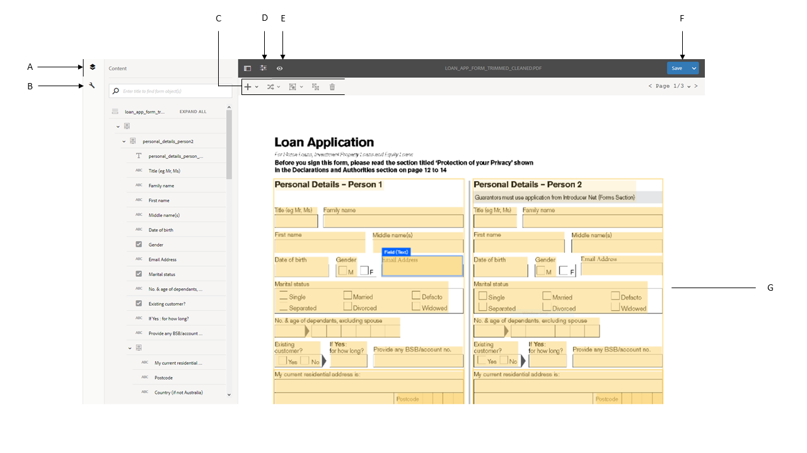
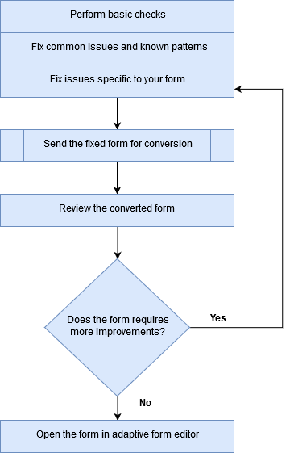
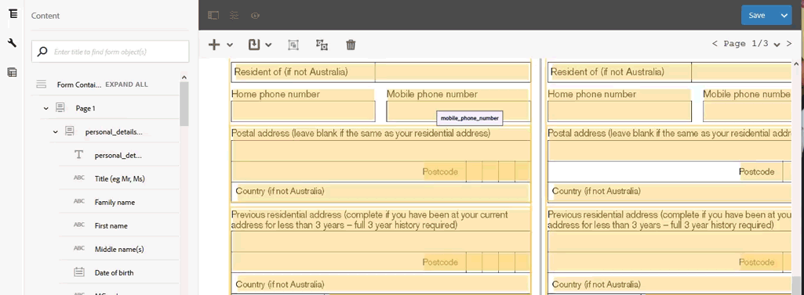
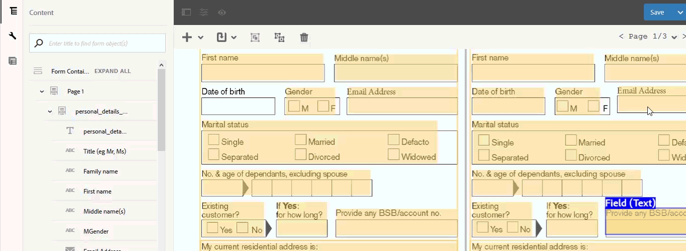

# 전환된 양식 검토 및 수정{#review-and-correct-converted-forms}

AEM Forms Automated forms conversion 서비스는 입력 PDF 문서의 필드, 컨텐츠 및 레이아웃을 식별하고 PDF 문서를 적응형 양식으로 변환합니다. 출력 적응형 양식에 누락되거나 잘못 변환된 필드가 있을 수 있습니다. 검토 및 수정 편집기를 사용하여 식별된 필드를 개선하고 적응형 양식을 재생성하여 원하는 경험에 가까운 출력을 얻을 수 있습니다. 첫 번째 변환 후 편집기에서 입력 PDF 문서를 열어 다음과 같은 작업을 수행할 수 있습니다.

* 전환 중에 식별된 모든 필드 및 콘텐츠 보기
* 전환 중 누락된 필드 및 콘텐츠 식별
* 필드 유형을 확인하고 필요한 경우 유형을 변경합니다
* 식별된 표를 확인하고 열 크기를 조정하며 셀 콘텐츠를 수정합니다
* 잘못 식별된 필드 제거

필요한 변경 작업을 수행한 후 PDF forms을 전환 서비스로 다시 보냅니다. 전환이 성공하면 적응형 양식 및 스키마를 포함하여 업데이트된 자산이 AEM Forms 인스턴스에 다운로드됩니다. 원하는 경험이 달성될 때까지 이 프로세스를 반복할 수 있습니다. 

검토 및 수정 편집기를 사용하려면 Google Chrome, Mozilla FireFox 또는 Microsoft Edge 브라우저가 필요합니다. 편집기에서 Internet Explorer를 지원하지 않습니다.

## 검토 및 수정 편집기 시작 {#welcome-to-review-and-correct-editor}

검토 및 수정 편집기는 사용하기 쉬운 인터페이스를 제공합니다. 다음과 같은 구성 요소가 있습니다.

* 컨텐츠 브라우저: 컨텐츠 브라우저를 사용하여 요소의 위치를 변경할 수 있습니다. 컨텐츠 브라우저를 사용하면 양식 객체를 드래그 앤 드롭하여 위치를 변경할 수 있습니다. 예를 들어 텍스트 상자 앞으로 테이블을 이동합니다. 그에 따라 출력 적응형 양식의 탭 순서를 변경합니다.
* 속성 브라우저: 선택한 필드의 속성을 표시합니다. 속성을 수정할 수도 있습니다.
* 도구 모음: 도구 모음은 편집기 상단에 있습니다. 필드를 추가, 수정, 그룹화, 그룹 해제 및 삭제할 수 있는 도구가 표시됩니다.
* 속성 열기: 속성 열기 옵션은  아이콘. 속성 열기 를 클릭하여 양식 속성을 열고 추가 옵션을 볼 수 있습니다.
* 필터 단추: 필터 단추  는 편집기의 맨 위에 있습니다. 필드를 필터링하여 텍스트, 필드, 선택 그룹, 패널 또는 모든 구성 요소만 표시할 수 있습니다.
* 저장 단추: **[!UICONTROL Save]** 버튼은 편집기의 오른쪽 상단에 있습니다. 저장 단추 옆에 있는 화살표를 사용하여 변환 양식을 전송하는 옵션을 볼 수도 있습니다.

* PDF 양식: 편집기에 소스 PDF 문서가 표시되고 식별된 필드로 오버레이됩니다. 도구 모음의 도구를 사용하여 필드를 수정할 수 있습니다.
* 페이지: 소스 양식에는 여러 페이지가 있을 수 있습니다. 편집기는 페이지 사이를 탐색하기 위한 단추를 오른쪽 상단에 제공합니다.

**A.** 컨텐츠 브라우저 **B.** 속성 브라우저 **C.** 도구 모음 **D.** 속성 단추 **E.** 필터 단추 **F** 저장 단추 **G.** PDF 양식이 식별된 필드로 오버레이됨

첫 번째 성공적인 전환 이후 전환 서비스는 소스 PDF 문서를 식별된 필드 및 구성 요소로 오버레이합니다. 이러한 필드 또는 구성 요소는 텍스트, 필드, 패널, 선택 그룹 및 테이블 유형입니다.

* 텍스트: 소스 PDF 문서의 일반 텍스트. 예를 들어, 위에 표시된 이미지에 있는 대출 신청 텍스트입니다.
* 필드: 값 또는 입력 상자와 연관된 텍스트 또는 아이콘 레이블의 조합입니다. 예를 들어 위 이미지의 첫 번째 필드 이름입니다. 텍스트 레이블과 입력란이 있습니다. 필드는 텍스트, 숫자, 드롭다운, 날짜, 이메일, 전화 번호, 서명, 통화 및 암호 데이터 유형을 지원합니다.
* 패널: 컨텐츠 및 구성 요소의 논리적 컬렉션 예를 들어, 개인 1 및 개인 2의 개인 세부 사항 은 위의 이미지에서 패널로 표시됩니다.
* 선택 그룹: 다중 선택 옵션과 연결된 텍스트 조합 : 확인란 및 라디오 버튼. 예: 위의 이미지에서 결혼 상태와 기존 고객.\
  선택 그룹 캡션과 다중 선택 옵션에 따라 전환 서비스는 선택 그룹을 단일 선택 라디오 단추 또는 다중 선택 확인란으로 자동 변환합니다. 예를 들어 다음 항목이 있을 경우 **하나 선택** 선택 그룹 캡션 또는 다중 선택 옵션으로 하나의 옵션만 선택할 수 있습니다. **예** 또는 **아니요**&#x200B;로 설정하면 전환 서비스가 선택 그룹을 단일 선택 라디오 단추로 자동 변환합니다. 마찬가지로, **해당되는 모든 항목 선택** 또는 **복수 선택** 선택 그룹 캡션 또는 다중 선택 옵션을 사용하여 여러 옵션을 선택할 수 있으므로 전환 서비스는 선택 그룹을 다중 선택 확인란으로 자동 변환합니다.

* 표: 열과 행에 표시되는 정보가 있는 2차원 표. 표에 행 또는 열을 추가하거나 제거할 수 있습니다.

## 전환 검토 시작 {#start-reviewing-a-conversion}

첫 번째 성공적인 전환 이후 전환 서비스는 소스 PDF 문서를 식별된 필드 및 구성 요소로 오버레이합니다. 식별된 필드를 개선하고 적응형 양식을 재생성하여 원하는 경험에 가까운 출력을 얻을 수 있습니다. 처음 전환에 성공한 후에만 전환 검토를 시작할 수 있습니다.

### 시작하기 전 {#before-you-start}

* 검토 및 수정 편집기는 조각을 지원하지 않습니다. 편집기를 사용하여 가 있는 전환을 검토하지 마십시오. **조각 추출** 전환 중에 옵션이 활성화되었습니다. 다음을 사용할 수 있습니다. [적응형 양식 편집기](https://helpx.adobe.com/experience-manager/6-5/forms/using/introduction-forms-authoring.html) 전환 시 사용해야 합니다.

* 검토 및 수정 편집기에 실행 취소 작업이 없습니다. 저장 단추는 변경 사항을 영구적으로 저장하는 경우에만 사용합니다.

### 리뷰 시작 {#start-the-review}

전환 검토를 시작하려면 전환에 사용되는 소스 PDF 문서를 선택하고 을 선택한 다음 탭합니다 **전환 검토**. 검토 및 수정 편집기가 새 탭에서 열립니다. 전환 검토를 시작할 수 있습니다. 다른 문제 해결을 시작하기 전에 다음 기본 검사를 수행하십시오.

1. **모든 필드의 유형 확인**: 전환 서비스가 필드에 잘못된 유형을 할당할 수 있습니다. 예를 들어 휴대폰 필드에 유형 전화 대신 유형 텍스트가 할당됩니다. 필드 위에 마우스를 올려 놓아 필드 유형을 찾을 수 있습니다.

   필드의 유형을 변경하려면 필드를 선택하고 속성 브라우저를 열고 **[!UICONTROL Type]** 드롭다운 및 탭 **[!UICONTROL Save]**. 유형이 변경되었습니다.

   

1. **추가 패널 제거**: 전환 서비스가 추가 패널을 생성할 수 있습니다. 예를 들어, 추가 하위 패널이 상위 패널에 포함되고, 빈 공간이 패널로 변환되고, 확인란이 패널로 변환됩니다. 모든 패널의 경계를 검토하고 추가 패널을 제거합니다. 필터를 사용할 수 있습니다  모든 패널을 보려면 버튼 또는 컨텐츠 브라우저를 사용하십시오.

   패널을 삭제하거나 그룹 해제하여 제거할 수 있습니다. 삭제 옵션을 사용하면 패널의 하위 필드 또는 구성 요소도 삭제됩니다.

   * 패널을 삭제하려면 패널을 선택하고 삭제를 누릅니다  아이콘을 클릭합니다. 확인 대화 상자에서 다음을 누릅니다. **[!UICONTROL Confirm]**. 누르기 **[!UICONTROL Save]** 변경 내용을 저장합니다.

   * 패널을 그룹 해제하려면 패널을 선택하고 도구 모음에서 그룹 해제 아이콘을 탭합니다. 패널이 그룹 해제되고 그룹 해제된 패널의 하위 필드가 상위 필드로 조정됩니다. 탭 **[!UICONTROL Save]**변경 내용을 저장합니다.

1. **텍스트의 논리 그룹 만들기**: 식별된 텍스트의 완전성과 정확성을 확인합니다. 또한 텍스트를 논리적으로 올바른 패널이나 그룹에 배치합니다. 예를 들어 다중 열 레이아웃에서 한 논리 그룹과 다른 그룹에 있는 텍스트를 예로 들 수 있습니다.

   * 텍스트의 완전성과 정확성을 검토하려면 필터를 사용합니다  단추를 클릭하여 텍스트만 보고 각 텍스트를 클릭한 다음 확인합니다. 맞춤법, 오타 또는 문법 문제가 있는 경우 수정하십시오.

   * 양식에 텍스트를 추가하려면 + 단추를 누르고 을 누릅니다 **[!UICONTROL Text]**. 상자를 그리고 속성 브라우저를 열고 콘텐츠 상자에 추가할 텍스트를 입력합니다.

1. **검토 테이블:** 표의 모든 테두리가 식별되었는지 확인합니다. 또한 셀의 내용이 올바르게 식별되는지 확인합니다.

   * 놓친 테두리를 식별하려면 **[!UICONTROL Add Column]** 또는 **[!UICONTROL Add Row]** 옵션을 선택합니다.

   * 추가 테두리를 제거하려면 **[!UICONTROL Delete Column]** 또는 **[!UICONTROL Delete Row]** 옵션을 선택합니다.

필요한 변경을 수행한 후 을 누릅니다. **[!UICONTROL Save & Convert]** 단추를 클릭하여 PDF forms을 전환 서비스로 다시 보냅니다. 각 필드는 해당 적응형 필드 구성 요소로 변환됩니다. 변환 후 적응형 양식 및 스키마를 포함하여 업데이트된 자산이 AEM Forms 인스턴스로 다운로드됩니다. 양식의 복잡성에 따라 서비스에서 변환을 완료하는 데 시간이 걸릴 수 있습니다.

기본 검사를 수행한 후 양식을 검토하여 조직 고유의 문제를 해결할 수 있습니다. 이러한 문제는 누락된 필드 추가 등과 관련될 수 있습니다. 다음을 볼 수 있습니다. [검토 및 수정 편집기 도구 사용](review-correct-ui-edited.md#use-the-review-and-correct-editor-tools) 섹션은 이러한 문제를 해결하기 위해 편집기가 제공하는 모든 도구에 대해 알아봅니다.

거의 모든 양식에서 발생하는 동일한 문제를 인식하는 작업을 수행하고 이러한 패턴을 Adobe에 보고할 수도 있습니다. 원하는 경험을 달성할 때까지 검토 및 수정 편집기를 사용하십시오.

## 검토 및 수정 편집기 도구 사용 {#use-the-review-and-correct-editor-tools}

검토 및 수정 편집기를 사용하여 다음 작업을 수행할 수 있습니다.

* [양식에 구성 요소 추가](review-correct-ui-edited.md#add-a-component-to-the-form)
* [표 추가 또는 편집](review-correct-ui-edited.md)
* [구성 요소 유형 변경](review-correct-ui-edited.md#change-type-a-component)

* [패널 만들기 또는 제거](review-correct-ui-edited.md#create-or-remove-a-panel)
* [패널 또는 구성 요소 삭제](review-correct-ui-edited.md#delete-a-panel-or-component)
* [구성 요소의 속성 설정](review-correct-ui-edited.md#set-properties-of-a-component)
* [전환을 위한 양식 보내기](review-correct-ui-edited.md#send-a-form-for-conversion)

### 양식에 구성 요소 추가 {#add-a-component-to-the-form}

변환 서비스가 인쇄 양식의 일부 구성 요소를 식별하지 못할 수 있습니다. 예를 들어, **생일** 전환 중에 양식의 구성 요소가 식별되지 않습니다. 다음을 사용할 수 있습니다. **+** 이러한 구성 요소를 식별하는 데 도움이 되는 도구입니다. 이 도구를 사용하여 텍스트, 필드, 선택 그룹, 표 및 패널 구성 요소를 추가할 수 있습니다.

양식에 구성 요소를 추가하려면 을 누릅니다 **[!UICONTROL +]** 및 탭 **[!UICONTROL Field]**. 필드의 레이블과 입력 상자를 덮는 상자를 그립니다. 예를 들어 위의 예제 이미지에서는 필드 구성 요소를 사용하여 **생일** 레이블 및 값 상자가 그 아래에 있는 양식으로 표시됩니다. 상자를 그리면 전환 서비스가 필드의 유형을 식별합니다. 필요한 경우 속성 브라우저에서 필드 유형을 변경할 수 있습니다. 구성 요소를 만든 후 속성 브라우저를 열고 구성 요소의 속성을 설정합니다.

누르기 **[!UICONTROL Save]** 버튼을 클릭하여 수정 사항을 저장하거나 **[!UICONTROL Save & Convert]** 단추를 클릭하여 PDF forms을 전환 서비스로 다시 보냅니다.

### 표 추가 또는 편집 {#addedittable}

변환을 수행하면 테이블 셀의 일부 셀, 경계 또는 콘텐츠가 미확인된 상태로 남을 수 있습니다. 예를 들어 표의 행은 식별되지 않습니다. 검토 및 수정 편집기를 사용하여 이러한 항목을 식별할 수 있습니다. 테이블에 대해 다음 작업을 수행할 수 있습니다.

* 테이블을 선택하려면 테이블의 셀을 클릭합니다.
* 셀, 이름, 제목, 유형 등의 속성을 수정하려면 셀을 두 번 클릭합니다. 셀을 두 번 클릭하여 콘텐츠를 수정하고, 필수 필드를 표시하고, 다른 속성을 선택할 수도 있습니다.
* 완전히 미확인된 테이블 또는 새 테이블을 양식에 추가/식별하려면 **[!UICONTROL +]** 도구.
* 표의 셀 또는 행 크기를 조정하려면 표의 빈 영역을 한 번 클릭하고 행 또는 열 경계를 마우스로 가리킨 다음 커서 포인터가 변경되면 경계를 선택하고 이동합니다. 크기를 조정한 후 **[!UICONTROL Done]** 을 클릭하여 변경 내용을 커밋합니다. 다음을 누를 수 있습니다. **[!UICONTROL ESC]** 키 : 크기 조정을 무시합니다.

* 행이나 열을 추가하거나 삭제하려면 표의 행에서 셀을 선택하고 **[!UICONTROL Add Row]**, **[!UICONTROL Add Column]**, **[!UICONTROL Delete Row]**, 또는 **[!UICONTROL Delete Column]** 옵션에서  메뉴 아래의 제품에서 사용할 수 있습니다.

* 셀을 표로 분할하려면 **[!UICONTROL Spilt Vertical]** 또는 **[!UICONTROL Split Horizontal]** 옵션에서  메뉴 아래의 제품에서 사용할 수 있습니다.

* 표의 셀을 병합하려면 병합할 셀을 선택하고 **[!UICONTROL Merge Cells]** 옵션 from  테이블 메뉴.

### 구성 요소 유형 변경 {#change-type-a-component}

전환 서비스가 잘못된 유형의 일부 필드를 만들 수 있습니다. 예를 들어 다음 이미지에서는 **성별** 필드가 (으)로 잘못 식별됨 **텍스트** 필드. 또한 레이블의 콘텐츠가 올바르지 않습니다. 필드는 선택 필드 유형이어야 하며 레이블은 성별이어야 합니다. 구성 요소의 유형을 변경하고 레이블을 수정하려면 다음을 수행합니다.

변환할 필드 선택, 탭  필드 유형을 탭합니다. 필드가 선택한 필드 유형으로 변환됩니다. 필드는 다음 표에 나열된 형식으로만 변환할 수 있습니다. 패널 구성 요소는 변환하지 않고 그룹화만 해제할 수 있습니다.

| **구성 요소** | **다음으로 변환** |
|---|---|
| 텍스트 | 필드 또는 선택 그룹 |
| 필드 | 텍스트 또는 선택 그룹 |
| 선택 그룹 | 텍스트 또는 패널 |

변환된 후 속성 브라우저를 열고 레이블을 지정하고 다른 필수 속성을 지정합니다. 누르기 **[!UICONTROL Save]** 단추를 클릭하여 수정 사항을 저장하거나 [저장 및 변환] 단추를 사용하여 PDF forms을 변환 서비스로 다시 보냅니다.

### 패널 만들기 또는 제거 {#create-or-remove-a-panel}

변환 서비스는 인쇄 양식의 관련 구성 요소 및 컨텐츠를 패널에 집계합니다. 예를 들어, 양식에는, 이름, 그림 번호, 영역, 도시, 주, 우편 번호 및 국가와 같은 필드가 있는 주소 패널이 있을 수 있습니다. 이러한 필드는 패널로 그룹화됩니다. 양식에는 여러 패널이 있을 수 있습니다.

전환 서비스는 다른 구성 요소와 관계가 없는 구성 요소가 있거나 상대적 구성 요소를 패널 외부에 남겨 두는 패널을 만들 수 있습니다. 그룹 또는 그룹 해제 도구를 사용하여 이러한 패널을 수정할 수 있습니다.

* 패널을 제거하려면 패널을 선택하고 그룹 해제를 누릅니다 . 패널이 제거되고 패널의 자식 구성 요소가 부모 구성 요소로 이동됩니다. 다음을 사용할 수도 있습니다 [구성 요소 삭제](review-correct-ui-edited.md#delete-a-panel-or-component) 선택 사항을 사용하여 패널과 해당 하위 항목을 삭제합니다.

* 패널을 만들려면 Ctrl 키(Windows 또는 Linux) 또는 Control 키(Mac)를 사용하여 관련 구성 요소를 선택하고 을 누릅니다  패널을 만듭니다. 속성 브라우저를 열어 패널의 속성을 지정합니다.

누르기 **[!UICONTROL Save]** 버튼을 클릭하여 수정 사항을 저장하거나 **[!UICONTROL Save & Convert]** 단추를 클릭하여 PDF forms을 전환 서비스로 다시 보냅니다.

### 패널 또는 구성 요소 삭제 {#delete-a-panel-or-component}

전환 서비스는 일부 잘못된 패널 또는 구성 요소를 식별할 수 있습니다. 이러한 패널의 이러한 구성 요소 대부분은 관련되지 않습니다. 이러한 패널 또는 구성 요소를 삭제할 수 있습니다.

패널이나 구성 요소를 삭제하려면 패널이나 구성 요소를 선택하고 삭제를 누릅니다  아이콘. 확인 대화 상자에서 을 누릅니다. **[!UICONTROL Confirm]**. 선택한 패널 또는 구성 요소가 삭제됩니다. 패널을 삭제하면 패널의 모든 하위 항목도 삭제됩니다. Windows 또는 Linux의 Ctrl 키 또는 Mac의 Control 키 를 사용하여 여러 구성 요소나 패널을 선택할 수 있습니다.

### 구성 요소의 속성 설정 {#set-properties-of-a-component}

양식의 모든 구성 요소에는 이름, 제목, 유형과 같은 속성 세트가 있습니다. 구성 요소의 속성을 설정하려면 구성 요소를 선택하고 속성 브라우저를 누릅니다. 선택한 구성 요소의 속성이 표시됩니다. 속성을 변경하거나 설정합니다.

누르기 **[!UICONTROL Save]** 버튼을 클릭하여 수정 사항을 저장하거나 **[!UICONTROL Save & Convert]** 단추를 클릭하여 PDF forms을 전환 서비스로 다시 보냅니다.

### 전환을 위한 양식 보내기 {#send-a-form-for-conversion}

검토 및 수정 편집기에서 필요한 모든 변경 작업을 수행한 후에는 전환을 위해 양식을 다시 보낼 수 있습니다. 전환을 위해 양식을 보내려면 을 누릅니다. **[!UICONTROL Save & Convert]**. 다음 **[!UICONTROL Sent for conversion label]** 은 소스 문서가 포함된 폴더에 적용되며 업데이트된 소스 양식은 Adobe I/O에서 실행되는 전환 서비스에 업로드됩니다.

양식의 복잡성에 따라 변환 서비스에서 양식을 변환하는 데 시간이 걸릴 수 있습니다. 전환이 완료되면 변환된 적응형 양식 및 관련 에셋이 컴퓨터에 다운로드됩니다. 전환이 완료된 후 편집기에서 양식을 검토하고 적응형 양식을 열 수 있습니다. [적응형 양식 편집기](https://helpx.adobe.com/experience-manager/6-5/forms/using/introduction-forms-authoring.html) 필요한 경우 최종 수정 세트에 대해 설명합니다.

적응형 양식 편집기에서 양식을 업데이트한 후 전환을 위해 양식을 다시 보내면 적응형 양식에서 수행된 모든 변경 사항이 손실됩니다. 성공적으로 전환한 후에만 검토 및 수정 편집기에서 양식을 열 수 있습니다.

<!--
Comment Type: draft

<h3>Open adaptive forms editor</h3>
-->

<!--
Comment Type: draft

There can be instances where you require adaptive forms editor to make the changes like, applying a different theme to the form or fixing tables. Once you have made all the required changes in Review and Correct editor and converted the form, you can open your form in adaptive forms editor to make the final set of changes.

To open the form with adaptive forms editor, tap the  icon, and tap <strong>Open Adaptive Form Editor</strong>. The form opens in adaptive form editor. 

## Previous {#previous}

[Use Automated Forms Conversion service](convert-existing-forms-to-adaptive-forms.md)
-->
