# 모범 사례 및 알려진 복잡한 패턴 {#Best-practices-and-considerations2}

이 문서에서는 을 사용하여 작업할 때 양식 관리자, 작성자 및 개발자가 활용할 수 있는 지침과 권장 사항을 제공합니다 [!DNL Automated Forms Conversion service]. 이 비디오에서는 소스 양식 준비에서 자동 전환을 위한 추가 작업이 필요한 복잡한 패턴 수정까지의 모범 사례에 대해 설명합니다. 이러한 모범 사례는 의 전반적인 성능과 출력에 전체적으로 기여합니다. [!DNL Automated Forms Conversion service].

## 우수 사례

전환 서비스는 AEM에서 사용할 수 있는 PDF forms을 전환합니다 [!DNL Forms] 인스턴스를 적응형 양식에 매핑합니다. 아래 나열된 모범 사례는 전환 속도 및 정확도를 향상시키는 데 도움이 됩니다. 또한 이러한 모범 사례는 전환 활동 후에 소요되는 시간을 절약하는 데 도움이 됩니다.

### 소스를 업로드하기 전에

필요에 따라 모든 PDF forms을 한 번에 또는 단계적으로 업로드할 수 있습니다. 양식을 업로드하기 전에 다음을 고려하십시오.

* 폴더의 양식 수를 15개 미만으로 유지하고 폴더의 총 페이지 수를 50개 미만으로 유지합니다.
* 폴더 크기를 10MB 미만으로 유지합니다. 하위 폴더에 양식을 보관하지 마십시오.
* 페이지 수를 15개 이하의 양식으로 유지합니다.
* 소스 문서를 8~15개 문서 묶음으로 구성합니다. 소스 양식을 일반적인 적응형 양식 조각과 함께 단일 배치로 유지합니다.
* 보호된 양식을 업로드하지 마십시오. 이 서비스는 암호로 보호되고 보안이 설정된 양식을 전환하지 않습니다.
* 업로드 안 함 [PDF Portfolio](https://helpx.adobe.com/acrobat/using/overview-pdf-portfolios.html). 이 서비스는 PDF Portfolio을 적응형 양식으로 전환하지 않습니다.
* 파일 이름에 공백이 있는 소스 양식을 업로드하지 마십시오. 양식을 업로드하기 전에 파일 이름에서 공백을 제거합니다.
* 스캔, 채우기 및 영어, 프랑스어, 독일어, 스페인어, 이탈리아어 및 포르투갈어가 아닌 다른 언어로 양식을 업로드하지 마십시오. 이러한 양식은 지원되지 않습니다.

변환을 위해 XDP 양식을 사용하는 경우 소스 XPD 양식을 업로드하기 전에 다음 단계를 수행하십시오.

* XDP 양식을 분석하고 시각적 문제를 해결합니다. 소스 문서에서 의도된 컨트롤과 구조를 사용하는지 확인합니다. 예를 들어 소스 양식에는 단일 선택을 위한 라디오 단추 대신 확인란이 있을 수 있습니다. 의도한 구성 요소가 있는 적응형 양식을 만들려면 확인란을 라디오 단추로 변경하십시오.
* [XDP 양식에 바인딩 추가](http://www.adobe.com/go/learn_aemforms_designer_65_kr) 전환을 시작하기 전에 소스 XDP 양식에서 바인딩을 사용할 수 있는 경우 변환 중에 서비스가 바인딩을 해당 적응형 양식 필드에 자동으로 적용합니다. 이렇게 하면 바인딩을 수동으로 적용하는 데 필요한 시간이 절약됩니다.
* [Adobe Sign 태그 추가](https://helpx.adobe.com/sign/using/text-tag.html) XDP 파일로 이동합니다. 이 서비스는 Adobe Sign 태그를 해당 적응형 양식 필드로 자동 전환합니다. 적응형 Forms은 제한된 수의 Adobe Sign 필드를 지원합니다. 지원되는 필드의 전체 목록은 다음을 참조하십시오. [적응형 양식에서 Adobe Sign 사용](https://experienceleague.adobe.com/docs/experience-manager-65/forms/adaptive-forms-advanced-authoring/working-with-adobe-sign.html?lang=en) 설명서를 참조하십시오.
* 가능하면 XDP 문서의 복잡한 표를 간단한 표로 변환합니다. 표 셀, 크기가 균일하지 않은 셀, 행 또는 열에 걸쳐 있는 셀, 병합된 셀, 부분 테두리 또는 보이는 테두리가 없는 표의 양식 필드가 있는 표는 복잡한 표로 간주됩니다. 위에서 언급한 항목 중 하나가 포함된 표는 복합 표로 간주됩니다.
<!-- * Use sub-forms in XDP documents to create panels in adaptive forms. Service converts each sub-form to one or more adaptive form panels during conversion. -->

### 전환을 시작하기 전에

* 적응형 양식 템플릿을 만듭니다. 템플릿은 조직 또는 부서 양식에 대한 균일한 구조를 지정하는 데 도움이 됩니다.
* 적응형 양식 템플릿에서 머리글과 바닥글을 지정합니다. 이 서비스는 소스 문서의 머리글-바닥글을 무시하고 적응형 양식 템플릿에 지정된 머리글-바닥글을 사용합니다.
* 적응형 양식 테마를 만듭니다. 테마는 조직 또는 부서의 양식에 동일한 모양과 느낌을 제공하는 데 도움이 됩니다.
* 데이터 소스에서 저장하고 검색하도록 양식 데이터 모델을 구성합니다. 양식 데이터 모델에 대한 읽기 및 쓰기 서비스를 만들고 구성합니다.
* 적응형 양식 조각을 만들고 적응형 양식 조각을 사용하도록 서비스를 구성합니다.
* 비즈니스 프로세스 자동화가 필요한 양식의 일반적인 워크플로우 모델을 준비합니다.
* 필요한 경우 Adobe Analytics 구성

## 복잡한 패턴 이해

AEM [!DNL Forms Automated Conversion service] 는 인공 지능과 머신 러닝 알고리즘을 사용하여 소스 양식의 레이아웃과 필드를 이해합니다. 모든 머신 러닝 서비스는 소스 데이터에서 지속적으로 학습하고, 이탈할 때마다 향상된 출력을 생성합니다. 이러한 서비스는 인간과 같은 경험으로부터 배웁니다.

[!DNL Automated Forms Conversion service] 는 다양한 양식 세트에 대해 교육됩니다. 소스 양식의 필드를 쉽게 식별하고 적응형 양식을 생성합니다. 하지만 PDF forms은 사람의 눈에는 쉽게 볼 수 있지만 서비스를 위해 이해하기 어려운 분야와 스타일이 존재한다. 이 서비스는 일부 필드 또는 스타일에 적용 가능한 필드 유형 또는 패널과 다른 것을 할당할 수 있습니다. 이러한 모든 필드 및 스타일 패턴은 아래에 나열되어 있습니다.

이 서비스는 소스 데이터에서 계속 학습하기 때문에 이러한 패턴에 올바른 필드 또는 패널을 식별하고 할당하기 시작합니다. 당분간 다음을 사용할 수 있습니다. [검토 및 수정](review-correct-ui-edited.md) 이러한 문제를 해결하기 위한 편집기. 문제를 수정하거나 더 자세히 읽기 전에 다음 사항에 대해 숙지하십시오. [적응형 양식 구성 요소](https://helpx.adobe.com/experience-manager/6-5/forms/using/introduction-forms-authoring.html).

### 일반 패턴 {#general}

| 패턴 | 예 |
|--- |--- |
| **패턴**  서비스는 채워진 PDF forms을 적응형 양식으로 전환하지 않습니다.   **해결 방법**  빈 적응형 양식을 사용하십시오. | 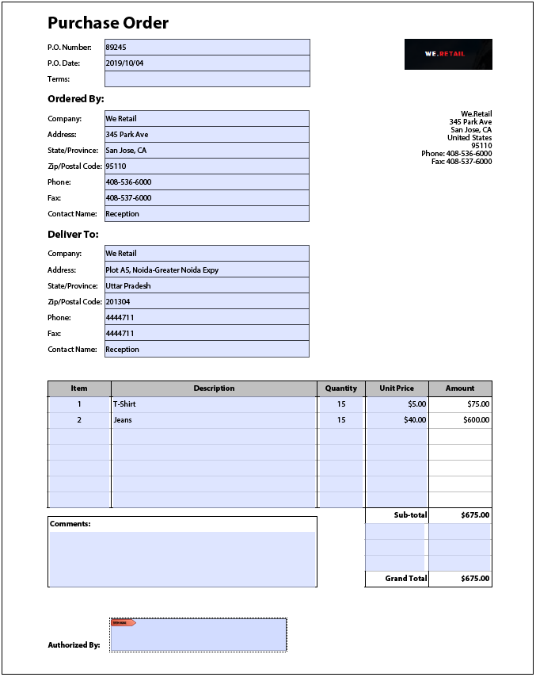 |
| **패턴**  서비스가 밀집된 형태의 텍스트와 필드를 인식하지 못할 수 있습니다.   **해결 방법**   전환을 시작하기 전에 조밀한 형태의 텍스트와 필드 사이의 너비를 늘리십시오. |  |
| **패턴**  서비스가 스캔한 양식을 지원하지 않습니다.   **해결 방법**  스캔한 양식을 사용하지 마십시오. |  |
| **패턴**  서비스는 이미지 내의 이미지와 텍스트를 추출하지 않습니다.   **해결 방법**   변환된 양식에 이미지 또는 텍스트를 수동으로 추가합니다. | 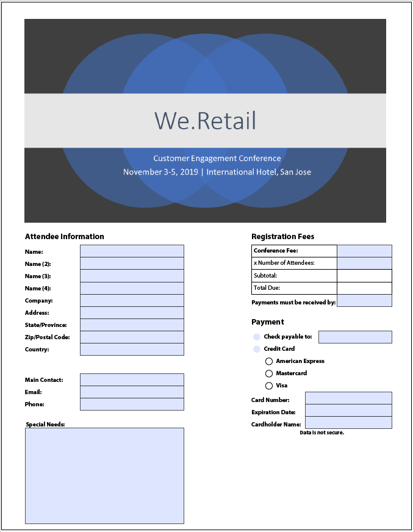 |
| **패턴**  경계 및 테두리가 점선 또는 명확하지 않은 테이블은 변환되지 않습니다.   **해결 방법**  명확한 경계와 테두리가 있는 표를 사용합니다. 지원됨. | 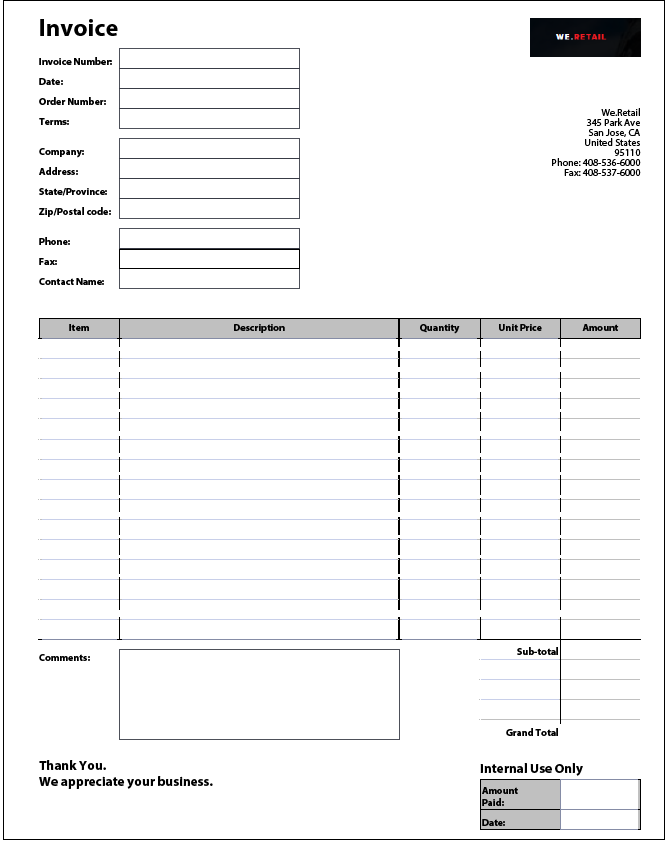 |
| **패턴**   적응형 양식은 즉시 사용할 수 있는 세로 텍스트를 지원하지 않습니다. 따라서 이 서비스는 세로 텍스트를 해당하는 적응형 Forms 텍스트로 변환하지 않습니다.   **해결 방법**   필요한 경우 적응형 양식 편집기를 사용하여 세로 텍스트를 추가합니다. | 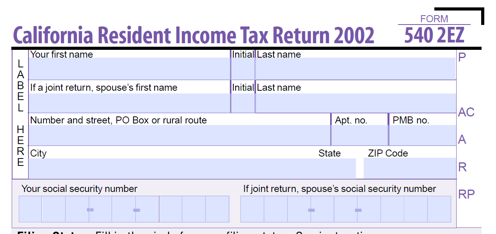 |

### 선택 그룹  {#choice-group}

| 패턴 | 해결 |
|--- |--- |
| **패턴**   상자 또는 원 이외의 도형이 있는 선택 그룹 옵션은 해당 적응형 양식 구성 요소로 변환되지 않습니다.   **해결 방법**   선택 옵션 모양을 상자 또는 원으로 변경하거나 검토 및 수정 편집기를 사용하여 모양을 식별합니다. | 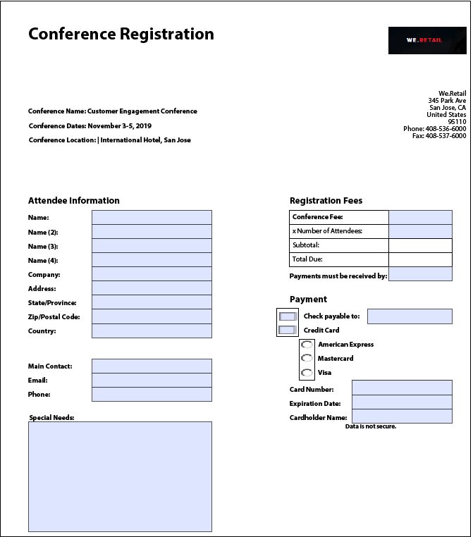 |

### 양식 필드 {#form-fields}

| 패턴 | 해결 |
|--- |--- |
| **패턴**   서비스는 명확한 테두리가 없는 필드를 식별하지 않습니다.   **해결 방법**   검토 및 수정 편집기를 사용하여 이러한 필드를 식별합니다. | 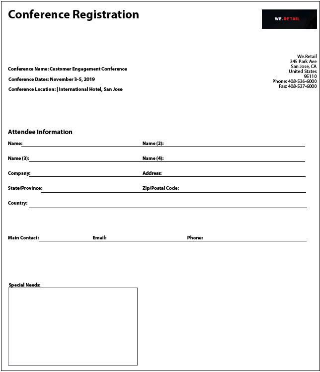 |
| **패턴**   서비스는 양식 하단 또는 오른쪽에 캡션이 있는 일부 선택 그룹 양식 필드를 식별하지 못할 수 있습니다.   **해결 방법**   검토 및 수정 편집기를 사용하여 이러한 필드를 식별합니다 | 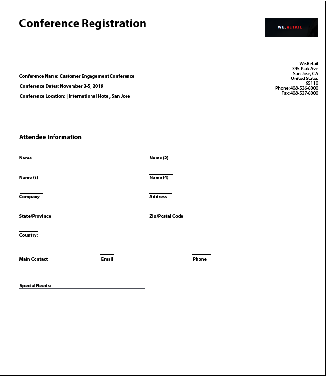 |
| **패턴**   서비스는 서로 매우 가깝게 배치되거나 명확한 테두리가 없는 일부 양식 필드를 병합하거나 잘못된 유형을 지정합니다.   **해결 방법**   검토 및 수정 편집기를 사용하여 이러한 필드를 식별합니다. | 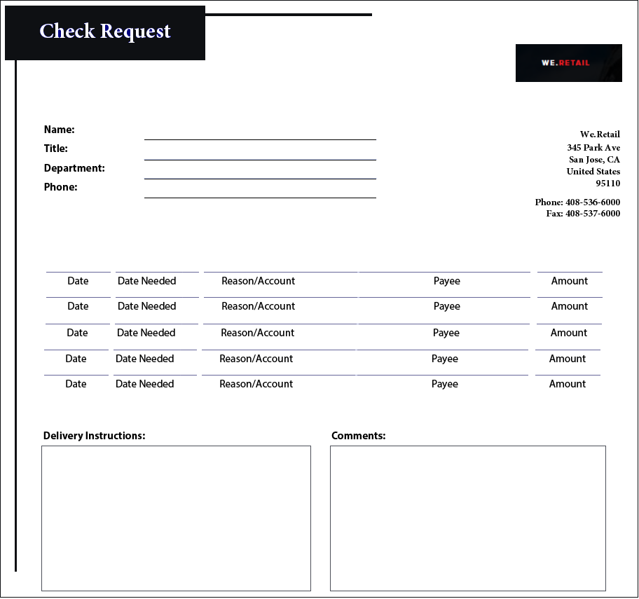 |
| **패턴**   서비스가 멀리 있는 캡션 또는 캡션과 입력 필드 사이에 점선이 있는 필드를 인식하지 못할 수 있습니다.   **해결 방법**   경계가 명확한 양식 필드를 사용하거나 검토 및 수정 편집기를 사용하여 이러한 문제를 수정하십시오. | 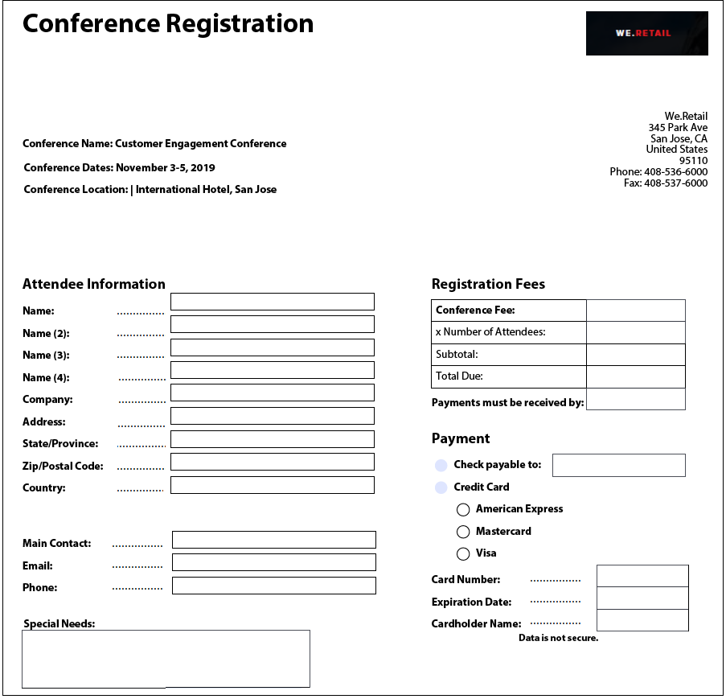 |

### 목록 {#lists}

| 패턴 | 해결 |
|--- |--- |
| **패턴**  양식 필드가 포함된 목록은 해당 적응형 양식 구성 요소로 병합되거나 변환되지 않습니다.   **해결 방법**  경계가 명확한 양식 필드를 사용하거나 검토 및 수정 편집기를 사용하여 이러한 문제를 수정하십시오. | 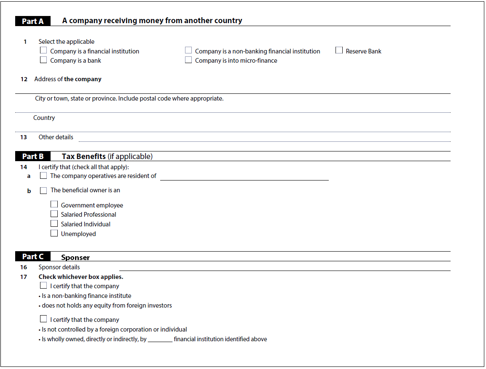 |
| **패턴**  서비스는 몇 개의 중첩된 목록을 미식별 상태로 둘 수 있습니다.   **해결 방법**   검토 및 수정 편집기를 사용하여 이러한 문제를 해결합니다. | 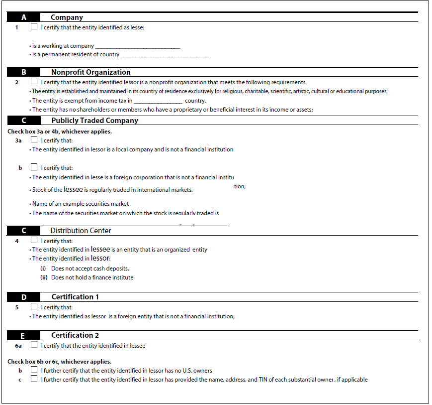 |
| **패턴**   서비스는 선택 그룹이 포함된 일부 목록을 서로 병합합니다.   **해결 방법**   검토 및 수정 편집기를 사용하여 이러한 문제를 해결합니다. | 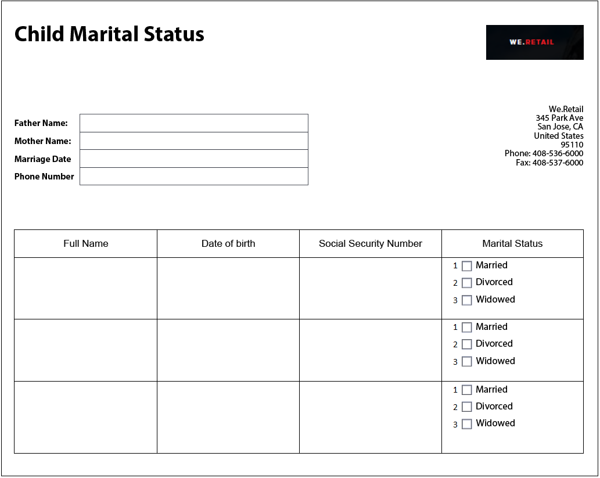 |

<!--
Comment Type: draft

<h3>Choice groups</h3>
-->

<!--
Comment Type: draft

<ul>
<li>Lists with form fields, nested lists, and nested choice groups are not supported.</li>
<li>Form fields with captions at bottom or right are not supported.</li>
<li>Form fields without borders are not supported.</li>
<li>Hidden form fields are not supported.</li>
<li>Button in PDF forms are not converted to adaptive form buttons.  </li>
<li>Tables with clear explicit boundaries and borders are supported.</li>
<li>Fields with far away captions are not supported.  </li>
<li>Choice groups with only box or circle shaped selectors are supported. </li>
</ul>
-->
